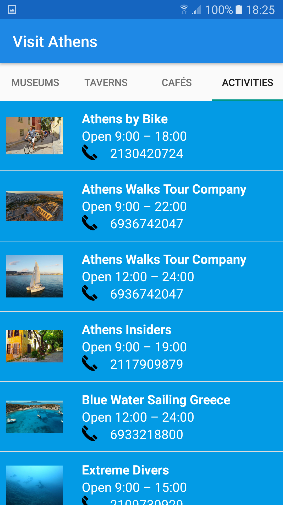

# Tour Guide App
Android App acting as a Tour Guide. It contains predetermined entries of Museums, Taverns, Cafes and Activities available in Athens.

### Prerequisites

Install the latest version of [Android Studio](https://developer.android.com/studio)

### Installing

Download the files and open the project from within [Android Studio](https://developer.android.com/studio).

## Built With

* [Android Studio](https://developer.android.com/studio) - The framework used

## Authors

* **Nikos Syrios** - [nikossyr](https://github.com/nikossyr)

## Screenshots

<table width="80%";>
  <tbody>
    <tr>
      <td align="center"></td>
      <td align="center"></td>
    </tr>
  </tbody>
</table>
